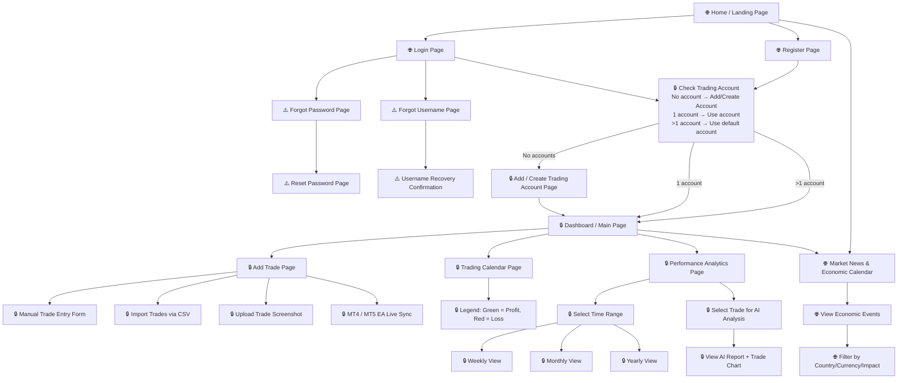

# App Flow

> 🌐 = Public page &nbsp;|&nbsp; 🔒 = Authenticated &nbsp;|&nbsp; ⚠️ = Auth utility

## Route Map

| Route | Access | Page |
|-------|--------|------|
| `/` | Public | Landing page |
| `/login` | Public | Login |
| `/register` | Public | Register |
| `/forgot-password` | Public | Forgot password |
| `/forgot-username` | Public | Forgot username |
| `/reset-password` | Public | Reset password |
| `/news` | Public | Market news & economic calendar |
| `/dashboard` | Auth | Main dashboard |
| `/accounts/new` | Auth | Add / create trading account |
| `/trades/new` | Auth | Add trade (manual, CSV, screenshot, MT4) |
| `/calendar` | Auth | Trading calendar |
| `/performance` | Auth | Performance analytics |
| `/performance/:tradeId/analysis` | Auth | AI report + trade chart |
